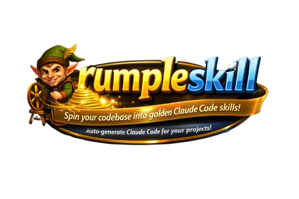

<p align="center">
  
</p>

# rumpleskill

*Spin your codebase into golden Claude Code skills.*

A local tool that automatically detects your tech stack and generates Claude Code skills for your projects. Uses Claude Code CLI directly - no external API required.

## Prerequisites

- Node.js 18+
- [Claude Code CLI](https://claude.ai/code) installed and authenticated

## Installation

```bash
# Clone or copy the project
cd rumpleskill

# Install dependencies
npm install

# Build
npm run build

# Link globally (optional)
npm link
```

## Usage

```bash
# Generate AGENTS.md + CLAUDE.md for a project
rumpleskill agents -p /path/to/project

# Generate skill files based on AGENTS.md
rumpleskill skills -p /path/to/project

# Generate both in one go
rumpleskill all -p /path/to/project

# Preview which skills would be generated (dry run)
rumpleskill detect -p /path/to/project

# Use a different model
rumpleskill all -p /path/to/project --model haiku
```

Or with npm:

```bash
npm run start -- all -p /path/to/project
```

## Commands

| Command | Description |
|---------|-------------|
| `agents` | Generate AGENTS.md (primary) + CLAUDE.md (reference) |
| `skills` | Generate skill files in `.claude/skills/` |
| `all` | Generate AGENTS.md, CLAUDE.md, and skills |
| `detect` | Preview skills that would be generated |

## Options

| Option | Description |
|--------|-------------|
| `-p, --project <path>` | Project root directory (default: current dir) |
| `-m, --model <model>` | Claude model: `sonnet`, `haiku`, `opus` (default: sonnet) |
| `-f, --force` | Overwrite existing files |
| `-h, --help` | Show help |

## How It Works

1. **agents**: Scans your project and generates `AGENTS.md` (comprehensive project docs) + `CLAUDE.md` (simple reference to AGENTS.md)
2. **detect**: Analyzes AGENTS.md to identify which technologies should have skills
3. **skills**: Generates individual SKILL.md files for each detected technology

This approach lets you maintain one source of truth (AGENTS.md) that works with both OpenAI Codex CLI and Claude Code.

All AI generation happens locally through Claude Code CLI - your code never leaves your machine (beyond normal Claude Code operation).

## Output Structure

```
your-project/
├── AGENTS.md              # Primary project documentation
├── CLAUDE.md              # References AGENTS.md
└── .claude/
    └── skills/
        ├── typescript/
        │   └── SKILL.md
        ├── react/
        │   └── SKILL.md
        └── frontend-design/
            └── SKILL.md
```

## Why "rumpleskill"?

Like Rumpelstiltskin spinning straw into gold, this tool spins your codebase into valuable Claude Code skills - automatically detecting your tech stack and generating skill files that help Claude understand your project's patterns and conventions.

## License

MIT
